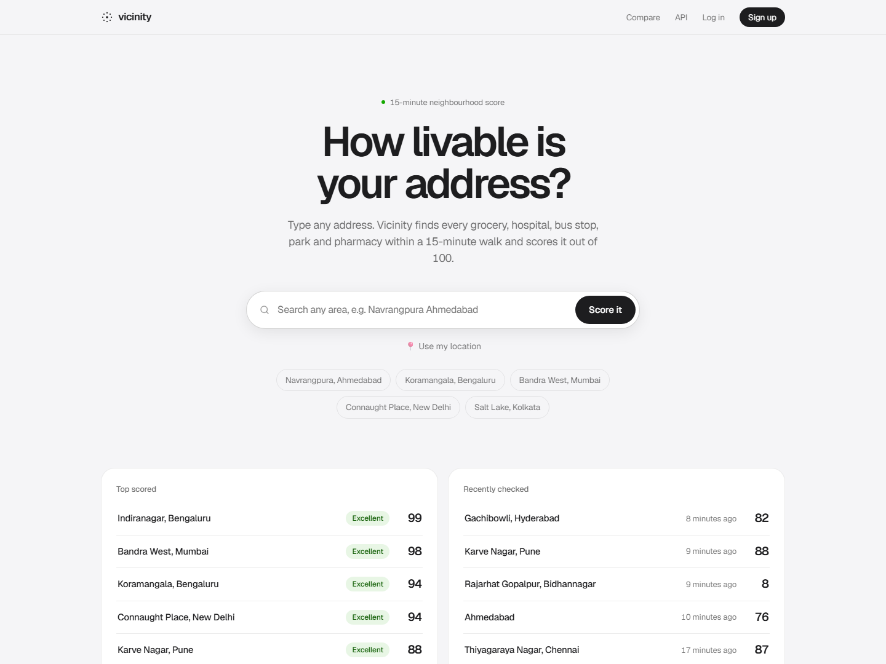

# Vicinity

**How livable is your address?** Type any address and Vicinity finds every grocery, hospital, bus stop, pharmacy and park within a **15-minute walk**, measures real walking times, and scores the area **out of 100**.

Built with **Django, Django REST Framework and PostgreSQL**, on free OpenStreetMap services.




---

## Features

| Feature | Details |
|---|---|
| **Typo-tolerant search** | Suggestions while typing: "koramangla", "navrangpra ahmdabad" and "conaught place" all find the right area. Scored areas match instantly from the database; other places come from Photon (OpenStreetMap search), limited to India and biased to the city you typed. |
| **Score out of 100** | 10 categories (groceries, hospitals, bus and metro, pharmacies, schools, parks, food, ATMs, police and fire, gyms), weighted to 100 points |
| **Real walking times** | Walking time to the nearest place of each kind, routed along streets (OSRM), not straight lines |
| **Map** | Every place on an OpenStreetMap map with the 15-minute circle; each category can be switched on and off |
| **Compare** | Two addresses side by side, category by category ("PG near college or flat near office?") |
| **Use my location** | The browser's location is turned into an address and scored |
| **Accounts** | Sign up, log in, save areas |
| **REST API** | `/api/score/`, `/api/areas/`, `/api/areas/<id>/`, with rate limiting |
| **Caching** | Every area and every geocoded address is saved in PostgreSQL, so the free map services are asked only once |

---

## How it works

```
"Navrangpura, Ahmedabad"
   │  Nominatim (geocoding, max 1 request/sec, results cached in GeocodeResult)
   ▼
23.036, 72.564  ──►  already scored within ~110 m in the last 30 days?  ──► yes: show it (0.001 s)
   │ no
   ▼  Overpass: every shop, clinic, stop and park within 1.2 km (3 servers, tried in turn, max 60 s)
110 places
   ▼  OSRM table: walking time to the nearest of each kind, in ONE request (estimate if the router is down)
   ▼  scoring.py:  points = weight × closeness × variety
82 / 100, "Excellent"  ──►  saved in one transaction (Area, CategoryScore, Place)
```

**The formula** (`areas/services/scoring.py`):
- **closeness**: nearest one ≤ 5 min walk = 1.0, ≤ 10 = 0.85, ≤ 15 = 0.65, ≤ 20 = 0.45, more = 0.25
- **variety**: 1 nearby = 0.7, 2–3 = 0.85, 4 or more = 1.0
- **category points** = weight × closeness × variety; **score** = the sum, out of 100

**Built to survive flaky free services:**
- If the main Overpass server is busy (HTTP 429 or 504), mirrors are tried, twice, within a 60-second limit.
- If every server is down but an older score exists, the older score is shown instead of an error.
- If the walking router is down, walking times are estimated (distance × 1.3 at 4.8 km/h) and marked with `~`.

---

## Data model

| Model | Purpose |
|---|---|
| `Area` | One scored location. `grid_key` (lat/lon rounded to ~110 m) is unique, so nearby searches share it. |
| `CategoryScore` | One row per category: points, count, nearest place, walking time |
| `Place` | The 20 nearest places per category, for the map |
| `SavedArea` | A user's bookmarks (unique per user and area) |
| `GeocodeResult` | Cached address → coordinates answers |

---

## REST API

| Endpoint | Returns |
|---|---|
| `GET /api/score/?address=Bandra West, Mumbai` | Scores any address: full breakdown and places. Rate limited to 20 per hour. |
| `GET /api/score/?lat=23.03&lon=72.56` | Same, for coordinates |
| `GET /api/suggest/?q=koramangla` | Typo-tolerant suggestions while typing (`&local=1` = instant database matches only) |
| `GET /api/areas/?search=ahmedabad` | Every scored area, best first (paginated) |
| `GET /api/areas/<id>/` | One area with categories and places |

Errors: `400` for missing input, `404` for an unknown address, `503` when map servers are busy, `429` when rate limited.

---

## Run locally

```powershell
git clone https://github.com/stackvs18/vicinity
cd vicinity
python -m venv venv
venv\Scripts\activate
pip install -r requirements.txt
python manage.py migrate
python manage.py load_demo_areas     # optional: pre-scores 10 Indian neighbourhoods
python manage.py runserver
```

Without a `DATABASE_URL`, it uses SQLite. Set `DATABASE_URL` to use PostgreSQL.

```powershell
python manage.py test areas          # 30 tests, no internet needed (map services are faked)
```

---

## Deploy (Render + Neon PostgreSQL, free)

1. **Neon** (neon.tech): create a project and copy the connection string.
2. **Render**: New → Web Service → this repo.
   - Build command: `./build.sh`
   - Start command: `gunicorn config.wsgi:application --bind 0.0.0.0:$PORT --timeout 120`
   - Environment variables:

     | Key | Value |
     |---|---|
     | `DATABASE_URL` | the Neon connection string |
     | `DJANGO_SECRET_KEY` | a long random string |
     | `DJANGO_DEBUG` | `False` |
     | `CSRF_TRUSTED_ORIGINS` | `https://<your-app>.onrender.com` |

`build.sh` installs packages, collects static files (served by WhiteNoise), runs migrations and pre-scores the demo areas.

---

## Project structure

```
config/                 settings (env-based), urls
areas/
  categories.py         the 10 categories, weights, and which OpenStreetMap tags belong to each
  models.py             Area, CategoryScore, Place, SavedArea, GeocodeResult
  services/
    geocoding.py        Nominatim, rate limited and cached
    suggestions.py      typo-tolerant search: fuzzy match + city recognition + Photon
    overpass.py         nearby places, with server fallback and a time limit
    walking.py          OSRM walking times (one table request) with an estimate fallback
    scoring.py          the formula: pure functions, fully tested
    area_builder.py     ties it all together, with caching and one transaction
  views.py              pages: home, search, area, compare, save, sign up
  api.py, serializers.py  REST API (DRF), rate limited
  management/commands/load_demo_areas.py
  tests/                scoring, area building (mocked services), pages and API
templates/, areas/templates/, areas/static/   HTML, CSS, JavaScript (Leaflet map)
```

---

## Known limits

- **OpenStreetMap is crowd-sourced.** The score reflects what's mapped: a street full of chemists scores 0 for pharmacies if nobody tagged them.
- The 15-minute circle is a 1.2 km straight-line radius; walking times are then measured along real streets.
- Typo matching on scored areas uses Python's difflib, which is fine for thousands of areas; at larger scale, PostgreSQL's `pg_trgm` trigram index would do it in the database.
- The free map servers are sometimes slow; the first score of a new area can take 5–30 seconds (repeats are instant).

Map data © OpenStreetMap contributors.
