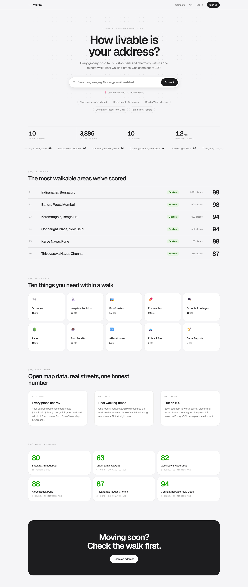
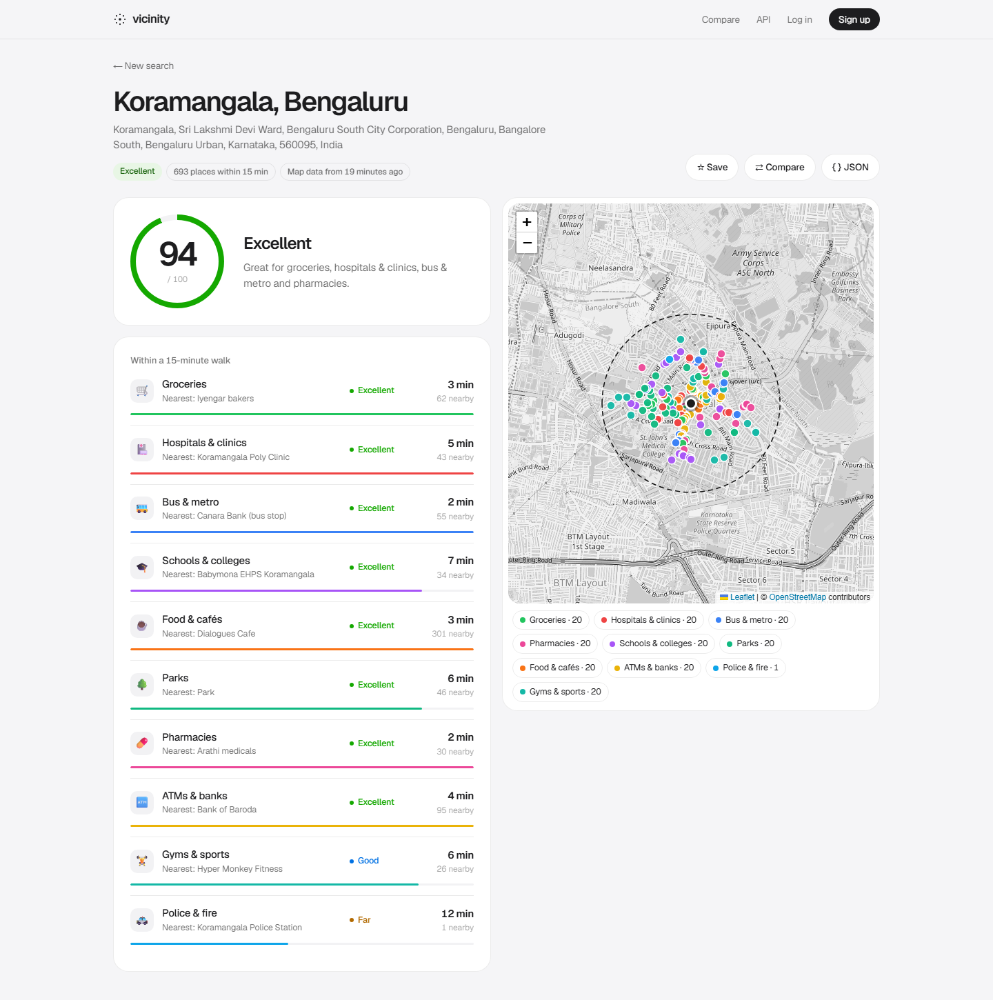
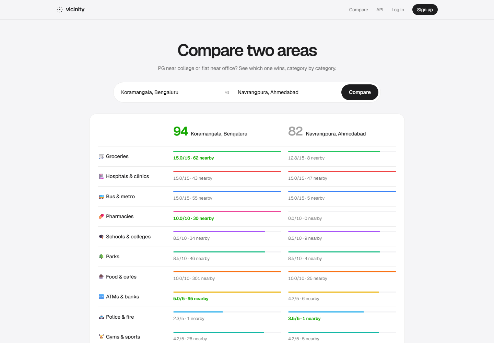
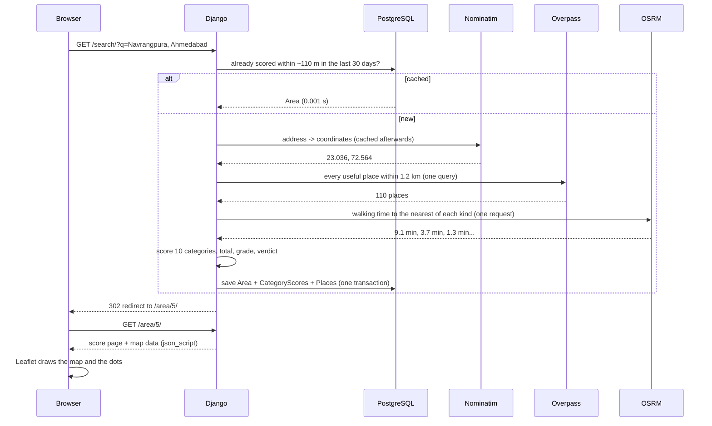
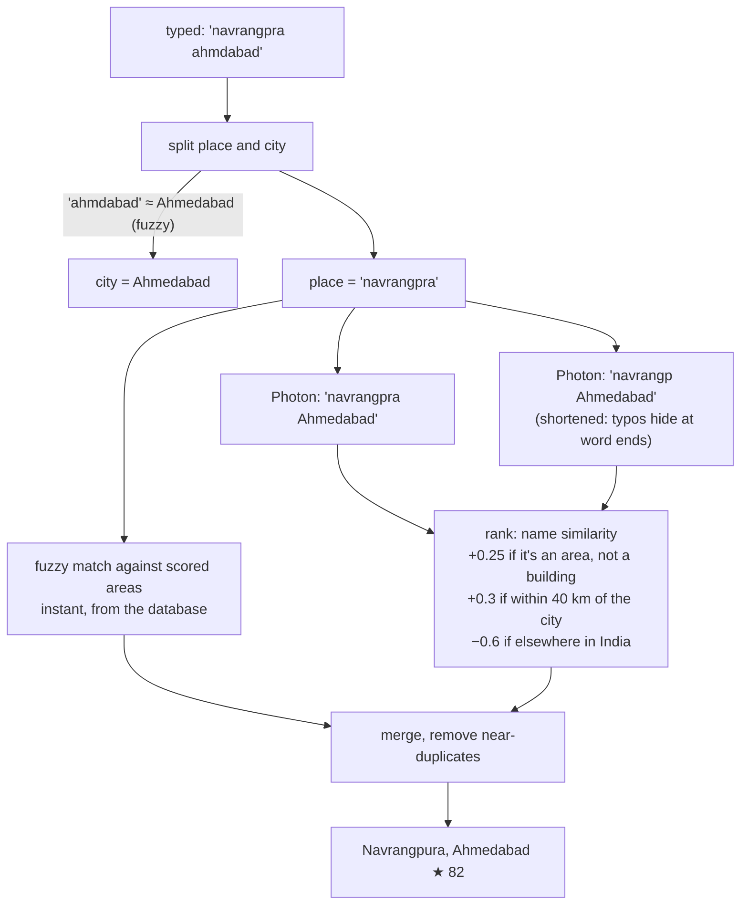
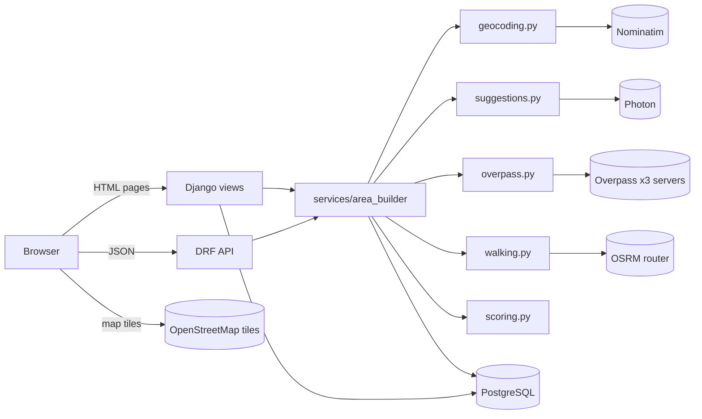
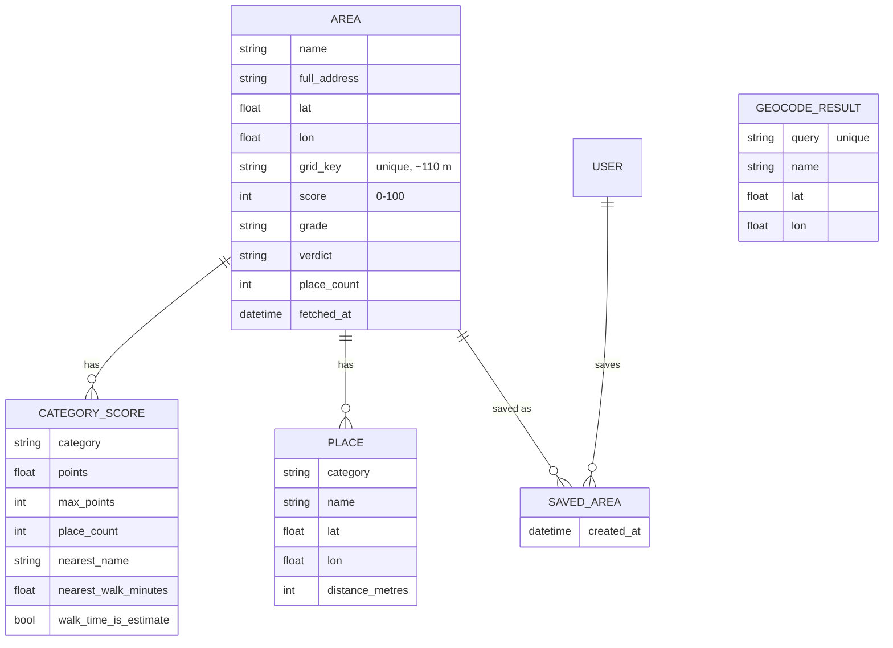
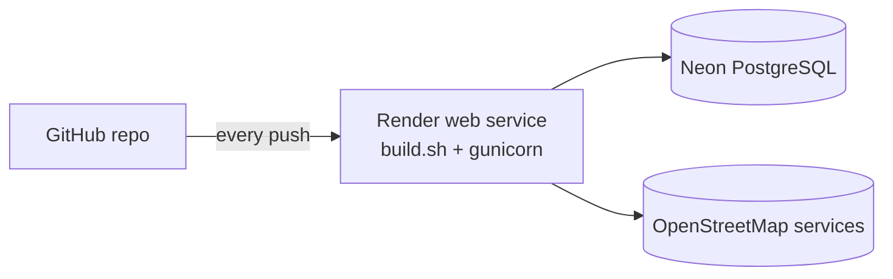

# Vicinity

**How livable is your address?** Type any address and Vicinity finds every grocery, hospital, bus stop, pharmacy and park within a **15-minute walk**, measures **real walking times** along streets, and scores the area **out of 100**.

Built with **Django 6.1, Django REST Framework and PostgreSQL**, entirely on free OpenStreetMap services. No API keys.

**Live demo:** (https://vicinity-4vyy.onrender.com/)



| Area page                   | Compare                      |
| --------------------------- | ---------------------------- |
|  |  |

---

## Why

Anyone choosing a PG, a flat or a hostel asks the same thing: _"Is there a grocery, a hospital, a bus stop near here?"_ Today you find out by zooming around a map one category at a time, guessing walking distances from straight lines.

Vicinity answers it in one search, with one number you can compare: **82/100 for Navrangpura, 94 for Koramangala**.

---

## Features

| Feature                  | What you get                                                                                                                                                                                                                        |
| ------------------------ | ----------------------------------------------------------------------------------------------------------------------------------------------------------------------------------------------------------------------------------- |
| **Score out of 100**     | A score ring, a grade (Excellent / Very good / Good / Fair / Limited) and a one-line verdict: _"Great for groceries and transport. Nothing within a 15-minute walk for pharmacies."_                                                |
| **10 categories**        | Groceries, hospitals and clinics, bus and metro, pharmacies, schools and colleges, parks, food and cafés, ATMs and banks, police and fire, gyms and sports. Each shows its nearest place, the walking time and how many are nearby. |
| **Real walking times**   | Routed along real streets (OSRM), not straight lines                                                                                                                                                                                |
| **Interactive map**      | Every place as a coloured dot inside the dashed 15-minute circle; click a category to hide or show it                                                                                                                               |
| **Typo-tolerant search** | Suggestions while typing: "koramangla", "navrangpra ahmdabad" and "conaught place" all work                                                                                                                                         |
| **Use my location**      | Your browser's location is scored directly                                                                                                                                                                                          |
| **Compare**              | Two areas side by side, category by category, with the winner highlighted                                                                                                                                                           |
| **Accounts**             | Sign up, log in, save areas                                                                                                                                                                                                         |
| **Leaderboard**          | The best-scored areas on the home page, plus live stats (areas scored, places mapped)                                                                                                                                               |
| **REST API**             | `/api/score/`, `/api/suggest/`, `/api/areas/`, `/api/areas/<id>/`, rate limited                                                                                                                                                     |
| **Admin**                | Django admin for areas, places, scores, saved areas and the geocode cache                                                                                                                                                           |

---

## Real results

| Area                              | Score  | Places within 15 min |
| --------------------------------- | ------ | -------------------- |
| Indiranagar, Bengaluru            | **99** | 1,021                |
| Bandra West, Mumbai               | **98** | 560                  |
| Koramangala, Bengaluru            | **94** | 693                  |
| Connaught Place, New Delhi        | **94** | 580                  |
| Karve Nagar, Pune                 | **88** | 185                  |
| Thiyagaraya Nagar, Chennai        | **87** | 239                  |
| Navrangpura, Ahmedabad            | **82** | 110                  |
| Gachibowli, Hyderabad             | **82** | 162                  |
| Satellite, Ahmedabad              | **80** | 81                   |
| Dharmatala (Park Street), Kolkata | **63** | 255                  |

A new area takes 5–30 s (the free map servers are slow); a cached area takes 0.001 s; suggestions for scored areas take 0.002 s.

---

## How a search works



1. **Search text → area.** `score_address()` tries, in order: a strong match among already-scored areas (instant, typo-tolerant), then Nominatim, then the best Photon suggestion (for misspellings).
2. **Cache check.** The coordinates are rounded to 3 decimals (about 110 m), e.g. `"23.036,72.564"`. If an area with that `grid_key` was fetched in the last 30 days, it's returned immediately.
3. **Places.** One Overpass query finds every shop, clinic, stop, school, park, ATM, police station and gym within 1.2 km.
4. **Categorise.** Each OpenStreetMap element's tags decide its category, e.g. `{"amenity": "pharmacy"}` → pharmacies.
5. **Walking times.** One OSRM "table" request returns walking times to the nearest place of every category at once.
6. **Score.** `scoring.py` turns walking time and count into points per category (below).
7. **Save.** The area, its 10 category scores and up to 20 places per category are saved in **one transaction** (all or nothing).
8. **Show.** The map data is embedded in the page with Django's `json_script`, so no extra request is needed.

---

## The scoring formula

Each category is worth a **weight**; the weights add up to 100.

| Category               | Weight |     | Category         | Weight |
| ---------------------- | ------ | --- | ---------------- | ------ |
| 🛒 Groceries           | 15     |     | 🌳 Parks         | 10     |
| 🏥 Hospitals & clinics | 15     |     | ☕ Food & cafés  | 10     |
| 🚌 Bus & metro         | 15     |     | 🏧 ATMs & banks  | 5      |
| 💊 Pharmacies          | 10     |     | 🚓 Police & fire | 5      |
| 🎓 Schools & colleges  | 10     |     | 🏋️ Gyms & sports | 5      |

```
category points = weight × closeness × variety
score           = sum of all category points (rounded)
```

| Walk to the nearest | closeness |     | How many within 15 min | variety |
| ------------------- | --------- | --- | ---------------------- | ------- |
| ≤ 5 min             | 1.00      |     | 0                      | 0.00    |
| ≤ 10 min            | 0.85      |     | 1                      | 0.70    |
| ≤ 15 min            | 0.65      |     | 2–3                    | 0.85    |
| ≤ 20 min            | 0.45      |     | 4 or more              | 1.00    |
| more                | 0.25      |     |                        |         |

**Grades:** 80+ Excellent · 65+ Very good · 50+ Good · 35+ Fair · below that, Limited.

<details>
<summary><b>Worked example: Navrangpura, Ahmedabad (82)</b></summary>

| Category      | Nearest walk | Count | Calculation     | Points        |
| ------------- | ------------ | ----- | --------------- | ------------- |
| Groceries     | 9.1 min      | 8     | 15 × 0.85 × 1.0 | 12.8          |
| Hospitals     | 3.7 min      | 47    | 15 × 1.0 × 1.0  | 15.0          |
| Bus & metro   | 1.3 min      | 5     | 15 × 1.0 × 1.0  | 15.0          |
| Schools       | 6.0 min      | 9     | 10 × 0.85 × 1.0 | 8.5           |
| Food          | 3.0 min      | 25    | 10 × 1.0 × 1.0  | 10.0          |
| Parks         | 8.6 min      | 4     | 10 × 0.85 × 1.0 | 8.5           |
| Pharmacies    | —            | 0     | 10 × 0 × 0      | 0.0           |
| ATMs & banks  | 8.9 min      | 6     | 5 × 0.85 × 1.0  | 4.2           |
| Gyms & sports | 7.7 min      | 5     | 5 × 0.85 × 1.0  | 4.2           |
| Police & fire | 4.7 min      | 1     | 5 × 1.0 × 0.7   | 3.5           |
| **Total**     |              |       |                 | **81.7 → 82** |

</details>

---

## Typo-tolerant search



- **City recognition:** 35 Indian cities plus old names ("bombay", "bangalore", "baroda"…), matched with `difflib` similarity ≥ 0.8.
- **Photon** is limited to India and runs **two queries at the same time** (threads): the text as typed and with shortened words.
- **Two requests from the browser:** `?local=1` answers instantly from the database; the full answer replaces it 1–3 s later. Late, outdated answers are ignored.
- **Typed names are kept:** "Satellite, Ahmedabad" lands on a point Nominatim calls "Ramdev nagar", but the page still says "Satellite, Ahmedabad".

---

## Built for flaky free services

| Problem                                                  | What Vicinity does                                                                                                                                                                      |
| -------------------------------------------------------- | --------------------------------------------------------------------------------------------------------------------------------------------------------------------------------------- |
| Nominatim allows 1 request per second                    | A lock and timer in `geocoding.py`; every answer is saved in `GeocodeResult`, so the same search never asks twice                                                                       |
| The main Overpass server is often busy (HTTP 429/504)    | Tries 3 servers in order, twice, and gives up after **60 s** so nobody waits forever                                                                                                    |
| Every map server is down, but the area was scored before | Shows the older score instead of an error                                                                                                                                               |
| The walking router is down                               | Estimates (straight line × 1.3 at 80 m/min) and marks the time with `~`                                                                                                                 |
| The same area is searched again                          | Areas are keyed by location rounded to ~110 m and cached for 30 days: **0.001 s**                                                                                                       |
| A live demo must never wait for the map servers          | 10 demo areas ship pre-scored in `areas/fixtures/demo_areas.json` and load on the first deploy                                                                                          |
| The scoring endpoint could be abused                     | DRF throttling: 20 scores and 600 suggestions per hour per visitor                                                                                                                      |
| Map tiles said "Access blocked"                          | Django's default `Referrer-Policy: same-origin` sends no Referer, and OpenStreetMap's tile servers require one. Fixed with `SECURE_REFERRER_POLICY = "strict-origin-when-cross-origin"` |

---

## Architecture



Views and API views are thin: they read the request, call a service and render the result. All the logic lives in `areas/services/`, so the pages, the API and the management command share it, and it's tested without HTTP.

---

## Data model



Constraints: `Area.grid_key` is unique · one `CategoryScore` per (area, category) · one `SavedArea` per (user, area). Indexes on `Area(-score)`, `Area(-created_at)` and `Place(area, category)`.

---

## REST API

| Method | Endpoint                                  | Returns                                                                       |
| ------ | ----------------------------------------- | ----------------------------------------------------------------------------- |
| GET    | `/api/score/?address=Bandra West, Mumbai` | Scores any address: full breakdown and places (20 per hour)                   |
| GET    | `/api/score/?lat=23.03&lon=72.56`         | The same, for coordinates                                                     |
| GET    | `/api/suggest/?q=koramangla`              | Typo-tolerant suggestions (`&local=1` = database only, instant)               |
| GET    | `/api/areas/?search=ahmedabad`            | Scored areas, best first, 20 per page                                         |
| GET    | `/api/areas/<id>/`                        | One area with its categories and places                                       |
| GET    | `/health/`                                | `{"status": "ok"}`, for the host's health checks (never touches the database) |

Errors: `400` missing input · `404` unknown address · `503` map servers busy · `429` rate limited.

```bash
curl "http://127.0.0.1:8000/api/suggest/?q=koramangla&local=1"
```

```json
{
  "results": [
    {
      "label": "Koramangala, Bengaluru",
      "detail": "Scored 94/100 · Excellent",
      "lat": 12.93,
      "lon": 77.62,
      "area_id": 5,
      "score": 94
    }
  ]
}
```

---

## Tech stack

| Layer         | Tool                                   | Why                                                                                   |
| ------------- | -------------------------------------- | ------------------------------------------------------------------------------------- |
| Web framework | **Django 6.1**                         | Auth, ORM, admin, templates and security defaults, all built in                       |
| API           | **Django REST Framework 3.18**         | Serializers, generic views, pagination and per-endpoint throttling                    |
| Database      | **PostgreSQL** (Neon) / SQLite (local) | `dj-database-url` reads one `DATABASE_URL`, so the same code runs on both             |
| Server        | **gunicorn** + **WhiteNoise**          | gunicorn runs Django in production; WhiteNoise serves compressed, cache-busted CSS/JS |
| Map           | **Leaflet 1.9** + OpenStreetMap tiles  | Free, light, no API key                                                               |
| Geocoding     | **Nominatim**                          | Address → coordinates                                                                 |
| Places        | **Overpass API**                       | "Every pharmacy within 1.2 km", all categories in one query                           |
| Walking times | **OSRM** (foot router)                 | Real street routing; one "table" request for many walking times                       |
| Suggestions   | **Photon**                             | Built for search-as-you-type                                                          |
| Design        | **Geist + Geist Mono**                 | Apple-style greys, one green accent (`#14a800`), monospace `[01]` labels              |

---

## Run locally

Needs Python 3.12+ and Git. No database server needed (SQLite is used when `DATABASE_URL` isn't set).

```powershell
git clone https://github.com/stackvs18/vicinity
cd vicinity
python -m venv venv
venv\Scripts\activate
pip install -r requirements.txt
python manage.py migrate
python manage.py load_demo_areas     # the 10 demo areas, instantly (from the fixture)
python manage.py createsuperuser     # optional, for /admin/
python manage.py runserver
```

Open http://127.0.0.1:8000 and search "koramangla". Also try http://127.0.0.1:8000/compare/?a=Koramangala&b=Navrangpura and http://127.0.0.1:8000/api/areas/.

To use PostgreSQL locally, copy `.env.example` to `.env` and set `DATABASE_URL`.

**Tests** (no internet needed; the map services are faked with `mock.patch`):

```powershell
python manage.py test areas          # 34 tests, about 1 second
```

They cover the scoring formula, tag categorisation, caching, server-down fallbacks, typo search, every page, saving (login required), every API status code, the health check and loading the demo areas on a fresh database.

---

## Deploy (Render + Neon PostgreSQL, free)



Everything is set up in [`render.yaml`](render.yaml), so deploying is mostly clicking:

1. **Neon** (neon.tech): create a project (region: Singapore) and copy the connection string.
2. **Render**: New → **Blueprint** → this repo (or use the button at the top). Render reads `render.yaml` and asks for:

   | Key                                                  | Value                          |
   | ---------------------------------------------------- | ------------------------------ |
   | `DATABASE_URL`                                       | the Neon connection string     |
   | `DJANGO_SUPERUSER_USERNAME` / `_EMAIL` / `_PASSWORD` | your admin login for `/admin/` |

   `DJANGO_SECRET_KEY` is generated by Render, `DJANGO_DEBUG` is `False`, and the site's own address (`RENDER_EXTERNAL_HOSTNAME`) is allowed automatically.

`build.sh` installs packages, collects static files, runs migrations, creates the admin account and loads the demo areas. On a brand-new database they're copied from the fixture in under a second, so the home page is full on the first visit even if the map servers are busy; after 30 days they're re-scored at their saved location. Gunicorn runs 2 workers × 4 threads with a 120 s timeout, because scoring a new address can take a while. Render checks `/health/`, which doesn't touch the database, so Neon's free database can sleep when nobody is using the site.

---

## Project structure

```
config/
  settings.py           one settings file for local and production (environment variables)
  urls.py               admin, login/logout, the areas app
templates/              base.html (nav, footer, loading screen), login and sign-up pages
areas/
  categories.py         the 10 categories, their weights, and which OpenStreetMap tags belong to each
  models.py             Area, CategoryScore, Place, SavedArea, GeocodeResult
  services/
    geocoding.py        Nominatim, rate limited (1/s) and cached
    suggestions.py      typo-tolerant search: fuzzy match + city recognition + Photon
    overpass.py         nearby places: 3 servers, 2 rounds, 60-second limit
    walking.py          OSRM walking times (one request), estimate if it fails
    scoring.py          the formula (pure functions, fully tested)
    area_builder.py     ties it all together, with caching and one transaction
    errors.py           AddressNotFound, MapServiceBusy
  views.py              pages: home, search, locate, area, compare, save, saved, sign up, health
  api.py, serializers.py  REST API (DRF), rate limited
  management/commands/load_demo_areas.py   demo areas: fixture first, refresh after 30 days
  fixtures/demo_areas.json                 the 10 pre-scored demo areas
  templates/areas/      home, area page, compare, saved
  static/areas/         style.css, site.js (search, suggestions, location), map.js (Leaflet)
  tests/                scoring, area building, suggestions, pages, API, deploy (34 tests)
render.yaml, build.sh   one-click Render deploy
```

---

## Known limits and next steps

**Limits**

- **OpenStreetMap is crowd-sourced.** The score reflects what's mapped: a street full of chemists scores 0 for pharmacies if nobody tagged them.
- The 15-minute area is a 1.2 km straight-line circle; the walking times inside it are real.
- The first score of a new area takes 5–30 s because the free servers are slow (repeats are instant).
- Typo matching on scored areas uses Python's `difflib`: fine for thousands of areas, not millions.

**Next steps**

1. Background scoring with Celery + Redis, so a new search returns instantly and the page fills in.
2. PostgreSQL's `pg_trgm` trigram index for fuzzy search inside the database.
3. PostGIS for distance queries, and true walking isochrones instead of a circle.
4. Personal weights ("gyms matter more to me than schools").
5. Self-hosted Overpass and OSRM for India.

---

Map data © [OpenStreetMap](https://www.openstreetmap.org/copyright) contributors.
